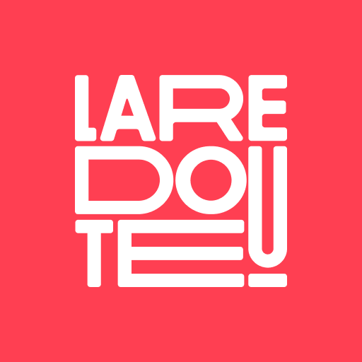

<!-- Improved compatibility of back to top link: See: https://github.com/othneildrew/Best-README-Template/pull/73 -->
<a name="readme-top"></a>
<!--
*** Thanks for checking out the Best-README-Template. If you have a suggestion
*** that would make this better, please fork the repo and create a pull request
*** or simply open an issue with the tag "enhancement".
*** Don't forget to give the project a star!
*** Thanks again! Now go create something AMAZING! :D
-->


<!-- PROJECT SHIELDS -->
<!--
*** I'm using markdown "reference style" links for readability.
*** Reference links are enclosed in brackets [ ] instead of parentheses ( ).
*** See the bottom of this document for the declaration of the reference variables
*** for contributors-url, forks-url, etc. This is an optional, concise syntax you may use.
*** https://www.markdownguide.org/basic-syntax/#reference-style-links
-->
[![MIT License][license-shield]][license-url]
[![LinkedIn][linkedin-shield]][linkedin-url]


<!-- PROJECT LOGO -->
<br />
<div align="center">
  <a href="https://github.com/JoaoFranco03/La-Redoute-Redesign/">
    
  </a>

<h3 align="center">La Redoute Redesign</h3>

  <p align="center">
    This project implements a 3D / AR viewer on <br>the LaRedoute website while simplifying the UI/UX.
    <br />
    <br />
  </p>
</div>


<!-- TABLE OF CONTENTS -->
<details>
  <summary>Table of Contents</summary>
  <ol>
    <li>
      <a href="#about-the-project">About The Project</a>
      <ul>
        <li><a href="#built-with">Built With</a></li>
      </ul>
    </li>
    <li>
      <a href="#getting-started">Getting Started</a>
      <ul>
        <li><a href="#installation">Installation</a></li>
      </ul>
    </li>
    <li><a href="#roadmap">Roadmap</a></li>
    <li><a href="#contact">Contact</a></li>
  </ol>
</details>


<!-- ABOUT THE PROJECT -->
## About The Project

[![Product Name Screen Shot][product-screenshot]](https://example.com)

This repository contains a Redesign Project of the La Redoute E-Commerce website.<br>
The goal of this project was to create a more modern, user-friendly and visually appealing version of the original website.<br>
I implemented features such as a 3D Furniture Viewer and an Augmented Reality Viewer to increase sales and user interactions.

<p align="right">(<a href="#readme-top">back to top</a>)</p>


### Built With

* [![HTML][HTML-badge]][HTML-url]
* [![CSS][CSS-badge]][CSS-url]
* [![JavaScript][JS-badge]][JS-url]
* [![Bootstrap][Bootstrap-badge]][Bootstrap-url]
* [![Three.js][Three-badge]][Three-url]

<p align="right">(<a href="#readme-top">back to top</a>)</p>


<!-- GETTING STARTED -->
## Getting Started

This is an example of how you may give instructions on setting up your project locally.
To get a local copy up and running follow these simple example steps.

### Installation

1. Clone the repo

  ```sh
   git clone https://github.com/JoaoFranco03/La-Redoute-Redesign/.git
   ```
 2. Run the Project in a Server

<p align="right">(<a href="#readme-top">back to top</a>)</p>


<!-- ROADMAP -->
## Roadmap

- [X] Design the UI/UX of the Website
- [X] Develop a 3D Viewer for the furniture
- [X] Develop a AR Viewer
- [ ] Further Optimize the Website for Mobile
- [ ] Improve Performance
<p align="right">(<a href="#readme-top">back to top</a>)</p>


<!-- CONTACT -->
## Contact

João Franco - https://www.linkedin.com/in/joão-franco-452161195/

Project Link: [https://github.com/JoaoFranco03/La-Redoute-Redesign/](https://github.com/JoaoFranco03/La-Redoute-Redesign/)

<p align="right">(<a href="#readme-top">back to top</a>)</p>


<!-- MARKDOWN LINKS & IMAGES -->
<!-- https://www.markdownguide.org/basic-syntax/#reference-style-links -->
[contributors-shield]: https://img.shields.io/github/contributors/github_username/repo_name.svg?style=for-the-badge
[contributors-url]: https://github.com/github_username/repo_name/graphs/contributors
[forks-shield]: https://img.shields.io/github/forks/github_username/repo_name.svg?style=for-the-badge
[forks-url]: https://github.com/github_username/repo_name/network/members
[stars-shield]: https://img.shields.io/github/stars/github_username/repo_name.svg?style=for-the-badge
[stars-url]: https://github.com/github_username/repo_name/stargazers
[issues-shield]: https://img.shields.io/github/issues/github_username/repo_name.svg?style=for-the-badge
[issues-url]: https://github.com/github_username/repo_name/issues
[license-shield]: https://img.shields.io/github/license/github_username/repo_name.svg?style=for-the-badge
[license-url]: https://github.com/JoaoFranco03/La-Redoute-Redesign/blob/master/LICENSE.md
[linkedin-shield]: https://img.shields.io/badge/-LinkedIn-black.svg?style=for-the-badge&logo=linkedin&colorB=555
[linkedin-url]: https://www.linkedin.com/in/joão-franco-452161195/
[product-screenshot]: assets/github/mockup.png
[Bootstrap-badge]: https://img.shields.io/badge/Bootstrap-563D7C?style=for-the-badge&logo=bootstrap&logoColor=white
[Bootstrap-url]: https://getbootstrap.com
[HTML-badge]: https://img.shields.io/badge/HTML-239120?style=for-the-badge&logo=html5&logoColor=white
[HTML-url]: https://developer.mozilla.org/en-US/docs/Web/HTML
[CSS-badge]: https://img.shields.io/badge/CSS-239120?&style=for-the-badge&logo=css3&logoColor=white
[CSS-url]: https://developer.mozilla.org/en-US/docs/Web/CSS
[JS-badge]: https://img.shields.io/badge/JavaScript-F7DF1E?style=for-the-badge&logo=javascript&logoColor=black
[JS-url]: https://developer.mozilla.org/en-US/docs/Web/JavaScript
[Three-badge]: https://img.shields.io/badge/threejs-black?style=for-the-badge&logo=three.js&logoColor=white
[Three-url]: https://threejs.org
